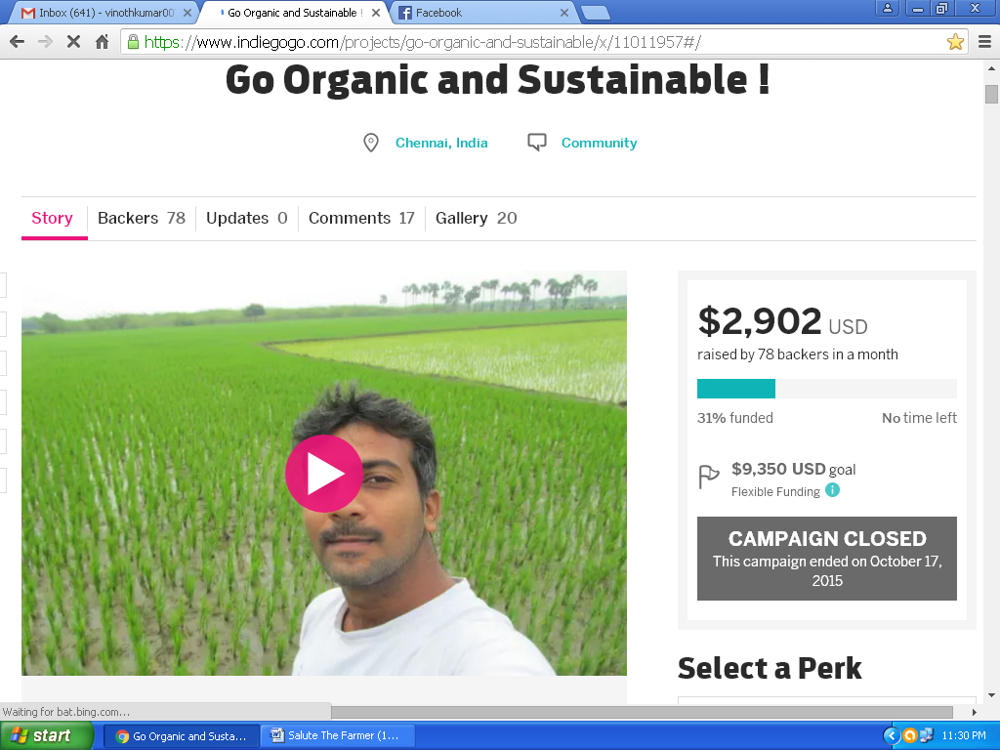
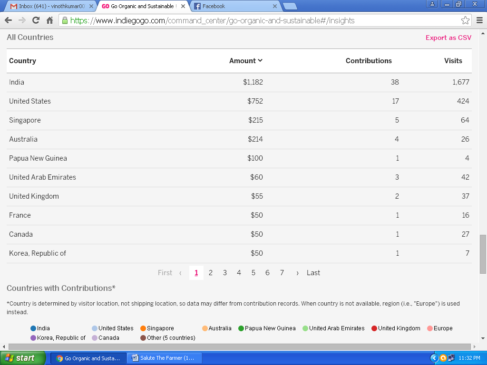
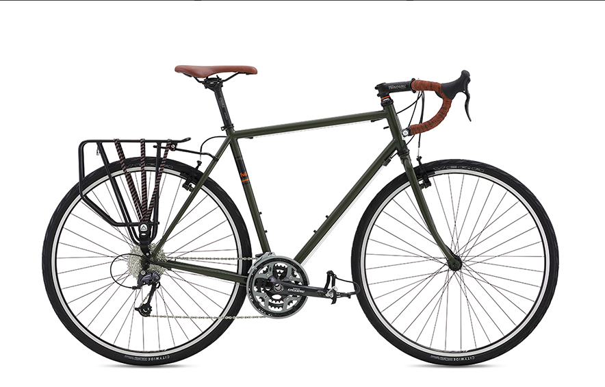

title: SALUTE THE FARMER
author:
  name: Vinoth Kumar & Raja S Pandian
  email: vinothkumar007@gmail.com, raja.vertigo@gmail.com
output: presentation.html
style: style.css
theme: sjaakvandenberg/cleaver-light
--
# Salute the Farmer
--
### Gameplan
A Cycle Expedition across India & South East Asia
--
# Who are we?
--
### Vinoth Kumar
Studied electrical engineering and did his MBA in HRM, and worked as a corporate employee with Standard Chartered Bank, Zoho & Groupon. 
Then, one day, he left all that to turn to farming! Yes, you read that right. 
I’ve taken farming as lifestyle rather than a profession. My Moto is to bring as many people as I can, back to farming. 
--
### Raja S Pandian
Not everyone's turning point in life starts with turtles. I am lucky to be among that clan.I work as a volunteer for SSTCN to conserve turtles in coast of Chennai. Have worked with Paperman a recycling startup. At present working as Project consultant for Bhumi a NGO providing supplementary education for underprivileged kids . Backpacking happened between all this. To travel for a cause, to travel to document the practice of sustainable agriculture and to promote it across South East Asia.
--
### Our inspiration for the project
Our interactions with farmers while backpacking across India, Nepal & Bhutan provoked the need of bringing awareness, documenting traditional knowledge in farming .
--
### Project Agenda
We will be cycling across 11 South East Asian Coutries. India, Bhutan, Burma, Thailand, Laos, Vietnam, Cambodia, Malaysia, Singapore, Indonesia, & Srilanka.
--
### Project Agenda
> a.) We will interact with School Kids , Students in Universities & General Public to increase awareness about the  Importance of farming & encourage them to be a part of agriculture community.
--
### Project Agenda
> b.) We will meet farmers to discuss about traditional farming methods followed by them and document it, also to understand their real time Challenges
--
### Expedition Duration
We will travel for a few months. We will decide the time required for the project as the needed.
--
### CONTRIBUTION to FARMDOST 
We would like to do this Expedition in collaboration with `FARMDOST` and we can:

> a.) Give updates to the Farmdost page like Photos, Videos, Interesting Information we gather on a regular basis.
--
### CONTRIBUTION to FARMDOST 
We would like to do this Expedition in collaboration with `FARMDOST` and we can:

> b.) Promote Farmdost to Schools, colleges and communities
--
### CONTRIBUTION to FARMDOST 
We would like to do this Expedition in collaboration with `FARMDOST` and we can:

> c.) Facilitate activities designed by Farmdost in schools
--
### CONTRIBUTION to FARMDOST 
We would like to do this Expedition in collaboration with `FARMDOST` and we can:

> d.) Share periodically the information collected regarding Traditional Knowledge and Real time challenges.
--
### CONTRIBUTION to FARMDOST 
We would like to do this Expedition in collaboration with `FARMDOST` and we can:

> e.) Share periodically the reports about School ,college and general public interactions.
--
### Budget
Total Cost of the project : 		`Rs.5,20,000.00`

Our Contribution : 			`Rs.2,50,000.00`

#### Which includes:

Money raised via Crowd Funding : 	`Rs.1,90,000.00`

Contribution By Vinoth & Raja : 	`Rs.60,000.00`
--
### Budget
This will cover Food , Accommodation , Local Travel Expenses, Recorder , Cycle Maintenance , Emergency expenses , Miscellaneous expenses, Camping Gears.
--
### Budget
Our crowdsourcing page:

--
### Budget
Support we got from across the Globe:

--
### Funding and Sponsorship needed
Cycle : [http://www.fujibikes.com/bike/details/touring-](http://www.fujibikes.com/bike/details/touring-)

Cost : `Rs.65,000`

No of Cycles : `2 `

Total : `Rs.1,30,000.00`

Accessories : `Rs.20,000`
--
### Funding and Sponsorship needed
Fuji Bikes needed:

--
### Funding and Sponsorship needed

Visa Charges for 9 countries for both of us. Approx : `Rs.80,000.00`

Flight Cost : `Rs.40,000.00`

Total funding required : `2,70,000`
--
> We are open to make changes to our plan to align with the Farmdost Expectations

# Thanks
